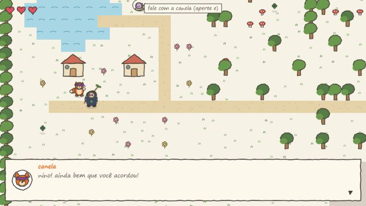
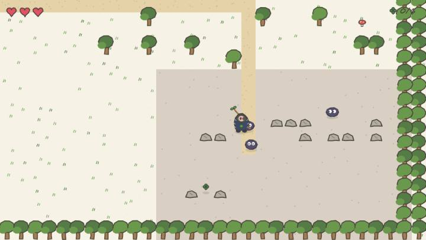

# 🍀 vale do trevo


Jogo 2D top-down com estética de **desenho feito à mão** — contornos tremidos, cores de canetinha e papel de fundo, como se o mundo inteiro tivesse saído de um caderno. Sem engine, sem sprites: **tudo é desenhado em código, traço a traço, no Canvas 2D**.

> 🎨 **Os personagens (Nino e Canela) nasceram no papel**: foram desenhados à mão por uma amiga querida, e o jogo inteiro foi construído ao redor do traço dela.

| a vila | as pedras do sul |
| --- | --- |
|  |  |

## Sumário

- [História](#história)
- [Como jogar](#como-jogar)
- [Funcionalidades](#funcionalidades)
- [Arquitetura](#arquitetura)
- [Rodando local](#rodando-local)
- [Roadmap](#roadmap)
- [Autoria](#autoria)

## História

Um borrão de tinta gigante passou pelo vale espirrando manchas por tudo que é lado — e os **6 trevos da sorte** se espalharam. Sem eles, as cores do vale vão desbotando. **Nino**, o ninja do bastão de lacinho, precisa recuperá-los: alguns estão perdidos pela floresta, outros ficaram com os **borrõezinhos** que rondam as pedras do sul. A raposa **Canela** orienta a missão; a **Dona Lesma** comenta tudo do jeito dela (bem devagar).

## Como jogar

| ação | desktop | celular |
| --- | --- | --- |
| andar | setas / WASD | direcional virtual |
| falar / avançar conversa | E, espaço ou clique | botão **falar** (ou toque na tela) |
| bastão | X ou J | botão **bastão** |

Trevos são coletados passando por cima. Encostar num borrão custa um coração; zerando os corações, o Nino desmaia e acorda na vila — sem perder progresso.

## Funcionalidades

- 🗺️ **Mapa com 4 biomas** (vila, lago, floresta e pedras) e câmera que segue o jogador
- 💬 **Sistema de diálogo** com retrato do personagem, efeito máquina-de-escrever e falas que mudam conforme o progresso da missão
- 👾 **Monstros com comportamento**: vagam pelo território e perseguem o jogador quando ele entra no bioma deles
- ⚔️ **Combate corpo a corpo** com arco de golpe, knockback, frames de invencibilidade e respawn justo (o borrão não renasce em cima de você)
- ✍️ **Motor de rabisco próprio**: cada forma é traçada com jitter determinístico por seed, e o traço "ferve" a ~5 fps como animação de caderno
- 📱 **Controles de toque** com direcional virtual, multi-touch e alvos generosos pro dedo
- 🏆 Missão completa com celebração, recorde de história e "fim do capítulo 1"

## Arquitetura

Sem engine e sem dependências de runtime — só Vite + TypeScript + Canvas:

```
src/
├── constants.ts   # medidas do mundo e paleta (cores tiradas do desenho original)
├── types.ts       # tipos compartilhados (entidades, mundo, diálogo)
├── sketch.ts      # "motor de rabisco": formas com contorno tremido e seed estável
├── world.ts       # mapa pintado por código: biomas, colisão, decoração, spawns
├── characters.ts  # Nino, Canela, Dona Lesma, borrões e retratos (arte em código)
├── dialogue.ts    # as conversas do capítulo 1
├── input.ts       # teclado + toque (direcional virtual, botões, modo modal)
├── game.ts        # estado e regras: física, combate, missão, câmera (zero DOM)
├── render.ts      # desenho do frame: chão, entidades por camada, HUD, diálogo
└── main.ts        # bootstrap: canvas, loop, hooks de debug (?debug=1)
```

A lógica (`game.ts`) não conhece o canvas e o desenho (`render.ts`) não altera estado — dá pra simular o jogo inteiro por código, que foi exatamente como o capítulo 1 foi testado.

## Rodando local

```bash
npm install
npm run dev
```

Abra `http://localhost:5173` (ou a porta que o Vite indicar). Com `?debug=1` na URL, o objeto do jogo fica exposto em `window.__game` para testes.

## Roadmap

- [ ] Sons (passos, bastão, coleta, falas)
- [ ] Save de progresso no navegador
- [ ] "Evolução" da Canela (mecânica de amizade inspirada nas setas arco-íris do desenho original)
- [ ] Capítulo 2: de onde veio o borrão gigante?
- [ ] Interiores das casas e mais moradores no vale

## Autoria

- **Desenvolvimento**: [Ana Flávia](https://github.com/An4D3v)
- **Arte original dos personagens**: desenho à mão de uma amiga querida 💚

Feito com carinho, café e canetinha.
